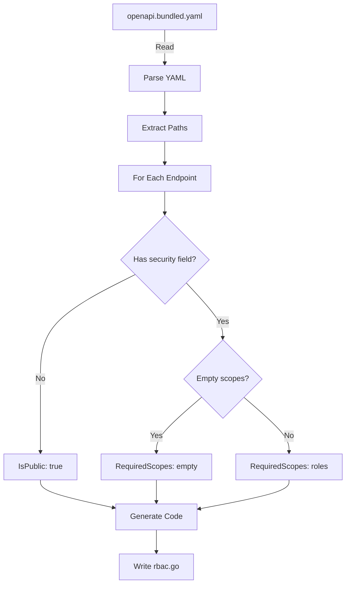

# RBAC Generator

## 🎯 Purpose

RBAC Generator adalah tool yang membaca OpenAPI specification dan menghasilkan Go code untuk security mapping.

## 📥 Input

**File:** `contracts/openapi.bundled.yaml`

OpenAPI specification dengan semua `$ref` sudah di-resolve.

## 📤 Output

**File:** `internal/generated/rbac.go`

Go code yang contains:
- `RouteSecurityInfo` struct
- `RouteSecurity` map

## 🔧 How It Works



## 🚀 Usage

### Method 1: Direct Execution

```bash
# Generate from default paths
go run cmd/generate-rbac/main.go

# Generate with custom paths
go run cmd/generate-rbac/main.go <input> <output>
go run cmd/generate-rbac/main.go contracts/openapi.bundled.yaml internal/generated/rbac.go
```

### Method 2: Using Makefile

```bash
# Add to Makefile
generate-rbac:
	@echo "Generating RBAC map..."
	@go run cmd/generate-rbac/main.go
	@echo "✅ RBAC map generated"

# Run
make generate-rbac
```

### Method 3: Automated Workflow

```bash
# Complete workflow
generate-all:
	@echo "1. Bundling OpenAPI..."
	@swagger-cli bundle contracts/openapi.yaml -o contracts/openapi.bundled.yaml
	@echo "2. Generating types..."
	@oapi-codegen -generate types -package generated contracts/openapi.yaml > internal/generated/types.go
	@echo "3. Generating server..."
	@oapi-codegen -generate gin -package generated contracts/openapi.yaml > internal/generated/server.go
	@echo "4. Generating RBAC..."
	@go run cmd/generate-rbac/main.go
	@echo "✅ All code generated"

make generate-all
```

## 📝 Generator Code

```go title="cmd/generate-rbac/main.go"
package main

import (
    "fmt"
    "log"
    "os"
    "path/filepath"
    "sort"
    "strings"

    "github.com/goccy/go-yaml"
)

type OpenAPISpec struct {
    Paths map[string]PathItem `yaml:"paths"`
}

type PathItem struct {
    Get    *Operation `yaml:"get,omitempty"`
    Post   *Operation `yaml:"post,omitempty"`
    Put    *Operation `yaml:"put,omitempty"`
    Delete *Operation `yaml:"delete,omitempty"`
    Patch  *Operation `yaml:"patch,omitempty"`
}

type Operation struct {
    OperationID string                `yaml:"operationId"`
    Security    []map[string][]string `yaml:"security,omitempty"`
}

func main() {
    // Parse input/output paths
    var specPath, outputPath string
    if len(os.Args) > 2 {
        specPath = os.Args[1]
        outputPath = os.Args[2]
    } else {
        specPath = "../contracts/openapi.bundled.yaml"
        outputPath = "internal/generated/rbac.go"
    }

    // Read OpenAPI spec
    data, err := os.ReadFile(specPath)
    if err != nil {
        log.Fatalf("Failed to read: %v", err)
    }

    // Parse YAML
    var spec OpenAPISpec
    if err := yaml.Unmarshal(data, &spec); err != nil {
        log.Fatalf("Failed to parse: %v", err)
    }

    // Generate code
    code := generateRBACCode(spec)

    // Write output
    os.MkdirAll(filepath.Dir(outputPath), 0755)
    if err := os.WriteFile(outputPath, []byte(code), 0644); err != nil {
        log.Fatalf("Failed to write: %v", err)
    }

    fmt.Printf("✅ Generated: %s\n", outputPath)
}

func generateRBACCode(spec OpenAPISpec) string {
    var sb strings.Builder
    
    // Header
    sb.WriteString("// Code generated - DO NOT EDIT.\n")
    sb.WriteString("package generated\n\n")
    
    // Struct definition
    sb.WriteString("type RouteSecurityInfo struct {\n")
    sb.WriteString("\tIsPublic       bool\n")
    sb.WriteString("\tRequiredScopes []string\n")
    sb.WriteString("}\n\n")
    
    // Map declaration
    sb.WriteString("var RouteSecurity = map[string]map[string]RouteSecurityInfo{\n")
    
    // Generate routes
    for path, item := range spec.Paths {
        methods := collectMethods(item)
        sb.WriteString(fmt.Sprintf("\t\"/api/v1%s\": {\n", path))
        
        for method, secInfo := range methods {
            sb.WriteString(fmt.Sprintf("\t\t\"%s\": {IsPublic: %v, RequiredScopes: %s},\n",
                method, secInfo.IsPublic, formatScopes(secInfo.RequiredScopes)))
        }
        
        sb.WriteString("\t},\n")
    }
    
    sb.WriteString("}\n")
    return sb.String()
}
```

## 📊 Generated Output Example

### Input (OpenAPI):

```yaml
paths:
  /auth/login:
    post:
      operationId: login
      # No security field
  
  /products:
    get:
      operationId: listProducts
      security:
        - BearerAuth: []
    post:
      operationId: createProduct
      security:
        - BearerAuth: [admin]
  
  /users:
    get:
      operationId: listUsers
      security:
        - BearerAuth: [admin]
```

### Output (Generated Go):

```go title="internal/generated/rbac.go"
// Code generated by oapi-codegen (generate-rbac) - DO NOT EDIT.
// Source: contracts/openapi.bundled.yaml

package generated

// RouteSecurityInfo contains security information for a route
type RouteSecurityInfo struct {
	IsPublic       bool
	RequiredScopes []string
}

// RouteSecurity defines security requirements for each route
var RouteSecurity = map[string]map[string]RouteSecurityInfo{
	"/api/v1/auth/login": {
		"POST": {IsPublic: true, RequiredScopes: nil},
	},
	"/api/v1/products": {
		"GET":  {IsPublic: false, RequiredScopes: []string{}},
		"POST": {IsPublic: false, RequiredScopes: []string{"admin"}},
	},
	"/api/v1/users": {
		"GET": {IsPublic: false, RequiredScopes: []string{"admin"}},
	},
}
```

## 🔍 Security Field Interpretation

| OpenAPI Config | IsPublic | RequiredScopes | Meaning |
|----------------|----------|----------------|---------|
| No `security` field | `true` | `nil` | Public endpoint |
| `BearerAuth: []` | `false` | `[]string{}` | Any authenticated |
| `BearerAuth: [admin]` | `false` | `[]string{"admin"}` | Admin only |
| `BearerAuth: [user, admin]` | `false` | `[]string{"user", "admin"}` | User or Admin |

## 🧪 Testing Generator

### Create Test Spec

```yaml title="test_spec.yaml"
paths:
  /public:
    get:
      operationId: publicEndpoint
  /protected:
    get:
      operationId: protectedEndpoint
      security:
        - BearerAuth: []
  /admin:
    get:
      operationId: adminEndpoint
      security:
        - BearerAuth: [admin]
```

### Run Generator

```bash
go run cmd/generate-rbac/main.go test_spec.yaml test_rbac.go
cat test_rbac.go
```

### Expected Output

```go
var RouteSecurity = map[string]map[string]RouteSecurityInfo{
	"/api/v1/public": {
		"GET": {IsPublic: true, RequiredScopes: nil},
	},
	"/api/v1/protected": {
		"GET": {IsPublic: false, RequiredScopes: []string{}},
	},
	"/api/v1/admin": {
		"GET": {IsPublic: false, RequiredScopes: []string{"admin"}},
	},
}
```

## 🛠 Customization

### Add Path Prefix

```go
// Modify generator to add custom prefix
fullPath := "/api/v2" + path  // Change v1 to v2
```

### Add Comments

```go
// Add comments to generated map
sb.WriteString(fmt.Sprintf("\t// %s - %s\n", method, operation.Summary))
sb.WriteString(fmt.Sprintf("\t\"%s\": {IsPublic: %v, ...}\n", method, ...))
```

### Sort Output

```go
// Sort paths alphabetically
paths := make([]string, 0, len(spec.Paths))
for path := range spec.Paths {
    paths = append(paths, path)
}
sort.Strings(paths)

for _, path := range paths {
    // Generate...
}
```

## ⚡ CI/CD Integration

### GitHub Actions

```yaml title=".github/workflows/generate.yml"
name: Generate Code

on:
  push:
    paths:
      - 'contracts/**'

jobs:
  generate:
    runs-on: ubuntu-latest
    steps:
      - uses: actions/checkout@v3
      
      - name: Setup Go
        uses: actions/setup-go@v4
        with:
          go-version: '1.21'
      
      - name: Bundle OpenAPI
        run: |
          npm install -g @apidevtools/swagger-cli
          swagger-cli bundle contracts/openapi.yaml -o contracts/openapi.bundled.yaml
      
      - name: Generate RBAC
        run: go run cmd/generate-rbac/main.go
      
      - name: Commit changes
        run: |
          git config --local user.email "action@github.com"
          git config --local user.name "GitHub Action"
          git add internal/generated/rbac.go
          git commit -m "chore: regenerate RBAC map" || echo "No changes"
          git push
```

### Pre-commit Hook

```bash title=".git/hooks/pre-commit"
#!/bin/bash

# Check if OpenAPI files changed
if git diff --cached --name-only | grep -q "^contracts/"; then
    echo "OpenAPI files changed, regenerating RBAC..."
    make generate-rbac
    git add internal/generated/rbac.go
fi
```

## 📚 Next Steps

1. [**Implement Middleware**](./middleware.md) - Use generated map
2. [**Test Security**](./testing.md) - Verify RBAC works
3. [**Troubleshooting**](./troubleshooting.md) - Fix common issues

## 🔗 Related

- [OpenAPI Setup](./openapi-setup.md) - Configure spec
- [RBAC Concepts](./concepts.md) - Understand fundamentals
- [Middleware Implementation](./middleware.md) - Apply security